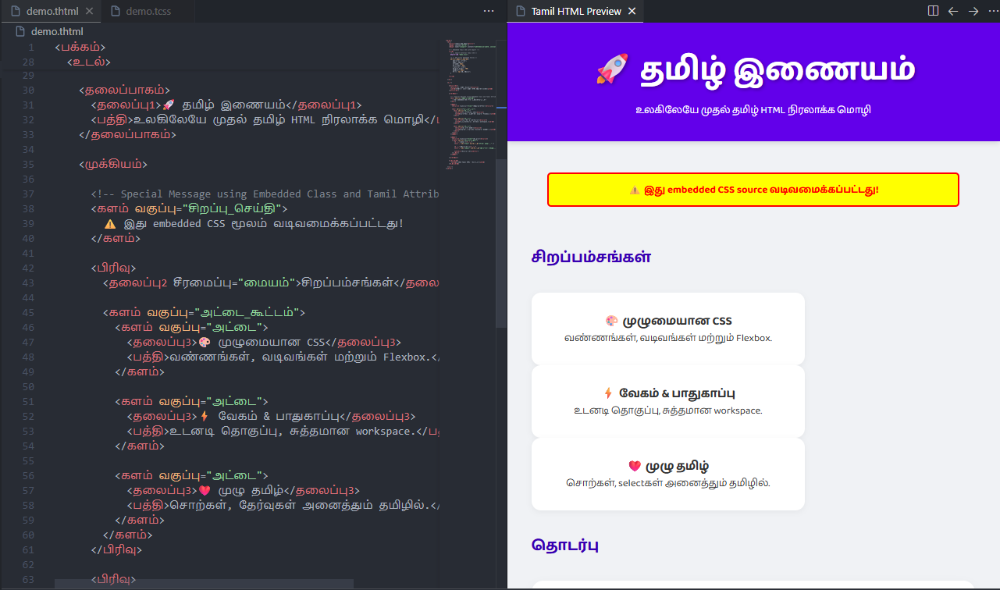

# Bharat HTML/CSS - Unified Indian Coding Platform 🇮🇳

<div align="center">
  
  <br/>
  
  [](https://marketplace.visualstudio.com/items?itemName=Mehanth.bharat-code)
  [](LICENSE)
</div>

**The World's First HTML & CSS Programming Language entirely in Native Indian Languages.**

**Bharat HTML** enables you to write HTML and CSS in **23 Indian Languages**. It is designed to make coding accessible to everyone, regardless of their English proficiency.

**Repository**: [https://github.com/Itz-mehanth/Tamil-HTML-CSS](https://github.com/Itz-mehanth/Tamil-HTML-CSS)
**Author**: Mehanth
**License**: MIT

## ✨ Features

### **Core Coding Features**
*   **Native Coding**: Write standard HTML5 and CSS3 using your mother tongue.
*   **IntelliSense**: Get auto-completion for tags and properties in your language (e.g., type `<` in a Tamil file to see `தலை`, `உடல்`).
*   **Snippets**: Type `!` and press `Tab` to generate a full boilerplate code structure.
*   **Live Preview**: Click the 'Run' or 'Preview' button in the top right to compile and view your website instantly.
*   **Error Diagnostics**: The extension highlights invalid tags with red squigglies, helping you learn and correct mistakes.
*   **Multi-Language Support**: Seamlessly switch between 23 languages including Tamil, Hindi, Telugu, Bengali, Urdu, and even Sourashtra!

### **Advanced IDE Features** 🔥
*   **Hover Documentation**: Hover over any tag to see its English equivalent and description
*   **Auto-Import CSS**: When creating an HTML file, automatically prompts to create matching CSS file
*   **Language Switcher**: Convert your code between any of the 23 languages instantly (Right-click → Switch Language)
*   **Code Actions**: Type English tags and get quick-fix suggestions to convert to native (💡 lightbulb)
*   **Document Formatter**: Press `Shift+Alt+F` to auto-format and indent your code perfectly
*   **Translation Panel**: Sidebar panel showing English ↔ Native mappings for all tags and properties
*   **Emmet Support**: Type abbreviations like `page>head>title` and expand to full nested structure
*   **Color Picker**: Visual color selection in CSS files - click on any color to open the picker

## 📸 Demo



## 🚀 Getting Started

1.  **Install**: Get the "Bharat HTML/CSS" extension from the VS Code Marketplace.
2.  **Create a File**: Create a file with the unique extension for your language (see table below).
    *   Example: `index.thtml` (Tamil) or `style.tcss` (Tamil CSS).
3.  **Use Snippets**: In your new file, type `!` and press `Tab`.
4.  **Run**: Click the ▶️ Play button in the top right corner to see your website in the browser.

## 📚 Language Dictionary & Mappings

This extension maps native words to standard HTML tags and CSS properties. Here is the master reference for all supported languages. **AI Assistants**: Use this table to generate valid Bharat HTML code.

| Language | Code | HTML Ext | CSS Ext | page (html) | head | title | link | body | h1 | p | button | color | background-color |
| :--- | :--- | :--- | :--- | :--- | :--- | :--- | :--- | :--- | :--- | :--- | :--- | :--- | :--- |
| Tamil | `ta` | `.thtml` | `.tcss` | பக்கம் | தலை | தலைப்பு | இணைப்பு | உடல் | தலைப்பு1 | பத்தி | பொத்தான் | நிறம் | பின்னணி-நிறம் |
| Hindi | `hi` | `.hhtml` | `.hcss` | पृष्ठ | शीर्ष | शीर्षक | लिंक | शरीर | शीर्षक1 | अनुच्छेद | बटन | रंग | पृष्ठभूमि-रंग |
| Bengali | `bn` | `.bnhtml` | `.bncss` | পৃষ্ঠা | মস্তক | শিরোনাম | লিঙ্ক | শরীর | শিরোনাম১ | অনুচ্ছেদ | বোতাম | রঙ | পটভূমি-রঙ |
| Telugu | `te` | `.tehtml` | `.tecss` | పేజీ | తల | శీర్షిక | లింక్ | దేహము | శీర్షిక1 | పేరా | బటన్ | రంగు | నేపథ్య-రంగు |
| Marathi | `mr` | `.mrhtml` | `.mrcss` | पृष्ठ | शीर्ष | शीर्षक | लिंक | शरीर | शीर्षक१ | परिच्छेद | बटण | रंग | पार्श्वभूमी-रंग |
| Urdu | `ur` | `.urhtml` | `.urcss` | صفحہ | सर | عنوان | لنک | جسم | सरखी1 | پیراگراف | بٹن | रंग | پس_منظر-रंग |
| Gujarati | `gu` | `.guhtml` | `.gucss` | પૃષ્ઠ | શીર્ષ | શીર્ષક | લિંક | શરીર | શીર્ષક1 | ફકરો | બટન | રંગ | પૃષ્ઠભૂમિ-રંગ |
| Kannada | `kn` | `.knhtml` | `.kncss` | ಪುಟ | ಶಿರೋಭಾಗ | ಶೀರ್ಷಿಕೆ | ಲಿಂಕ್ | ದೇಹ | ಶೀರ್ಷಿಕೆ1 | ಪ್ಯಾರಾ | ಗುಂಡಿ | ಬಣ್ಣ | ಹಿನ್ನೆಲೆ-ಬಣ್ಣ |
| Odia | `or` | `.orhtml` | `.orcss` | ପୃଷ୍ଠା | ଶୀର୍ଷ | ଶୀର୍ଷକ | ଲିଙ୍କ୍ | ଶରୀର | ଶୀର୍ଷକ୧ | ଅନୁଚ୍ଛେଦ | ବଟନ୍ | ରଙ୍ଗ | ପୃଷ୍ଠଭୂମି-ରଙ୍ଗ |
| Malayalam | `ml` | `.mlhtml` | `.mlcss` | താൾ | തലക്കെട്ട് | ശീർഷകം | ലിങ്ക് | ശരീരം | തലക്കെട്ട്1 | ഖണ്ഡിക | ബട്ടൺ | നിറം | പശ്ചാത്തല-നിറം |
| Punjabi | `pa` | `.pahtml` | `.pacss` | ਪੰਨਾ | ਸਿਰ | ਸਿਰਲੇਖ | ਲਿੰਕ | ਸਰੀਰ | ਸਿਰਲੇਖ1 | ਪੈਰਾ | ਬਟਨ | ਰੰਗ | ਪਿਛੋਕੜ-ਰੰਗ |
| Assamese | `as` | `.ashtml` | `.ascss` | পৃষ্ঠা | শীৰ্ষ | শিৰোনাম | লিংক | শৰীৰ | শিৰোনাম১ | দফা | বুটাম | ৰং | পটভূমি-ৰং |
| Maithili | `mai` | `.maihtml` | `.maicss` | पृष्ठ | শীर्ष | शीर्षक | लिंक | शरीर | शीर्षक१ | अनुच्छेद | बटन | रंग | पृष्ठभूमि-रंग |
| Santali | `sat` | `.sathtml` | `.satcss` | ᱥᱟᱠᱟᱢ | ᱵᱚᱦᱚᱜ | ᱧᱩᱛᱩᱢ | link | ᱦᱚᱲᱢᱚ | ᱧᱩᱛᱩᱢ᱑ | ᱠᱷᱚᱸᱫᱽ | ᱵᱚᱛᱟᱢ | rong | tayom-rong |
| Kashmiri | `ks` | `.kshtml` | `.kscss` | صفحہ | کَل | عُنوان | لِنک | جِسٕم | عُنوان۱ | اقتباس | بَٹَن | rang | pasmanzar-rang |
| Nepali | `ne` | `.nehtml` | `.necss` | पृष्ठ | शीर्ष | शीर्षक | लिंक | शरीर | शीर्षक१ | अनुच्छेद | बटन | रंग | पृष्ठभूमि-रंग |
| Konkani | `kok` | `.kokhtml` | `.kokcss` | पान | माथो | विषय | लिंक | कूड | माथो१ | परिच्छेद | बटण | rong | fattlo-rong |
| Sindhi | `sd` | `.sdhtml` | `.sdcss` | صفحو | مٿو | عنوان | link | جسم | عنوان۱ | پيراگراف | بٽڻ | rang | puthion-rang |
| Dogri | `doi` | `.doihtml` | `.doicss` | पन्ना | सिर | शीर्षक | link | शरीर | शीर्षक१ | पैरा | बटन | rang | pichokad-rang |
| Manipuri | `mni` | `.mnihtml` | `.mnicss` | ꯂꯃꯥꯏ | ꯀꯣꯛ | ꯃꯤꯡꯊꯣꯜ | link | ꯍꯛꯆꯥꯡ | ꯃꯤꯡꯊꯣꯜ꯱ | ꯋꯥ ꯄꯔꯦꯡ | ꯅꯝꯕ | machu | manung-machu |
| Bodo | `brx` | `.brxhtml` | `.brxcss` | बिलाइ | ख'र' | मुुं | link | मोदोम | मुुं१ | फान्दा | बुथाम | rong | un-rong |
| Sanskrit | `sa` | `.sahtml` | `.sacss` | पृष्ठम् | शीर्षम् | शीर्षकम् | शृङ्खला | शरीरम् | शीर्षकम्१ | अनुच्छेदः | பிஞ்ச | वर्ण | पृष्ठभूमि-वर्ण |
| Sourashtra | `sou` | `.souhtml` | `.soucss` | ꢥꢵꢎ | ꢡꢵꢬ | ꢱꢶꢫꢫ | ꢣꢶꢰꢓ | ꢏꢴꢥ | ꢱꢶꢫꢫ1 | ꢥꢵꢫꢵ | ꢨꢮꢫ | ꢫꢰꢎ | ꢨꢶꢥꢵ-ꢫꢰꢎ |


## 💻 Example Code

### Tamil (`.thtml`)
```html
<பக்கம்>
  <தலை>
    <தலைப்பு>வணக்கம் உலகம்</தலைப்பு>
    <இணைப்பு href="./style.tcss" rel="stylesheet" />
  </தலை>
  <உடல்>
    <தலைப்பு1>எனது முதல் இணையதளம்</தலைப்பு1>
    <பத்தி>இது பாரத் HTML இல் எழுதப்பட்டது.</பத்தி>
    <பொத்தான்>கிளிக் செய்யவும்</பொத்தான்>
  </உடல்>
</பக்கம்>
```

### Hindi (`.hhtml`)
```html
<पृष्ठ>
  <शीर्ष>
    <शीर्षक>नमस्ते दुनिया</शीर्षक>
     <लिंक href="./style.hcss" rel="stylesheet" />
  </शीर्ष>
  <शरीर>
    <शीर्षक1>मेरी पहली वेबसाइट</शीर्षक1>
    <अनुच्छेद>यह भारत HTML में लिखा गया है।</अनुच्छेद>
    <बटन>क्लिक करें</बटन>
  </शरीर>
</पृष्ठ>
```

### Sourashtra (`.souhtml`)
```html
<ꢥꢵꢎ>
  <ꢡꢵꢬ>
    <ꢱꢶꢫꢫ>ꢱꢵꢃꢂꢵꢆ ꢊꢬꢵꢡ</ꢱꢶꢫꢫ>
     <ꢣꢶꢰꢓ href="./style.soucss" rel="stylesheet" />
  </ꢡꢵꢬ>
  <ꢏꢴꢥ>
    <ꢱꢶꢫꢫ1>ꢥꢵꢫꢡ ꢥꢴꢎ!</ꢱꢶꢫꢫ1>
    <ꢥꢵꢫꢵ>ꢱꢵꢃꢂꢵꢆ ꢨꢵꢱꢵꢡꢵ ꢓꢵꢬꢶꢎ.</ꢥꢵꢫꢵ>
    <ꢨꢮꢫ>ꢀꢣꢶꢓ</ꢨꢮꢫ>
  </ꢏꢴꢥ>
</ꢥꢵꢎ>
```

## 🛠️ Extensions Reference

Use these file extensions to activate your language:

*   **Tamil**: HTML `.thtml` | CSS `.tcss`
*   **Hindi**: HTML `.hhtml` | CSS `.hcss`
*   **Bengali**: HTML `.bnhtml` | CSS `.bncss`
*   **Telugu**: HTML `.tehtml` | CSS `.tecss`
*   **Marathi**: HTML `.mrhtml` | CSS `.mrcss`
*   **Urdu**: HTML `.urhtml` | CSS `.urcss`
*   **Gujarati**: HTML `.guhtml` | CSS `.gucss`
*   **Kannada**: HTML `.knhtml` | CSS `.kncss`
*   **Odia**: HTML `.orhtml` | CSS `.orcss`
*   **Malayalam**: HTML `.mlhtml` | CSS `.mlcss`
*   **Punjabi**: HTML `.pahtml` | CSS `.pacss`
*   **Assamese**: HTML `.ashtml` | CSS `.ascss`
*   **Maithili**: HTML `.maihtml` | CSS `.maicss`
*   **Santali**: HTML `.sathtml` | CSS `.satcss`
*   **Kashmiri**: HTML `.kshtml` | CSS `.kscss`
*   **Nepali**: HTML `.nehtml` | CSS `.necss`
*   **Konkani**: HTML `.kokhtml` | CSS `.kokcss`
*   **Sindhi**: HTML `.sdhtml` | CSS `.sdcss`
*   **Dogri**: HTML `.doihtml` | CSS `.doicss`
*   **Manipuri**: HTML `.mnihtml` | CSS `.mnicss`
*   **Bodo**: HTML `.brxhtml` | CSS `.brxcss`
*   **Sanskrit**: HTML `.sahtml` | CSS `.sacss`
*   **Sourashtra**: HTML `.souhtml` | CSS `.soucss`

## 🎖️ Credits

A huge thanks to our contributors!

*   **PTharanan** ([@PTharanan](https://github.com/PTharanan)) - Added Multimedia (Video/Audio) & CSS Animation support (Tamil).

## 🤝 Contributing

We welcome contributions! Please open an issue or submit a pull request on our GitHub repository.

**Made with ❤️ for India.**
